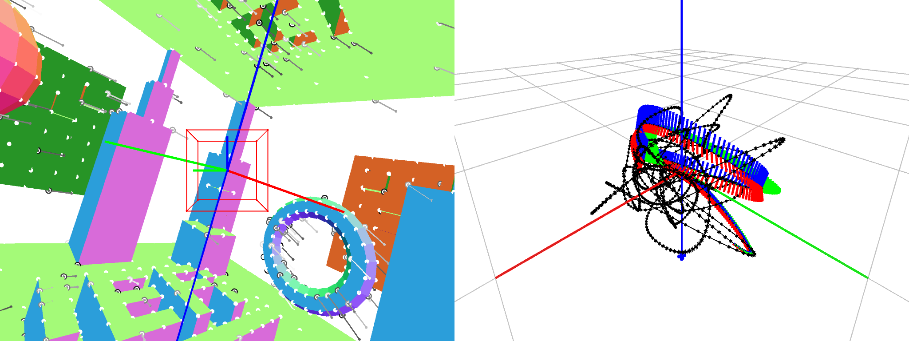
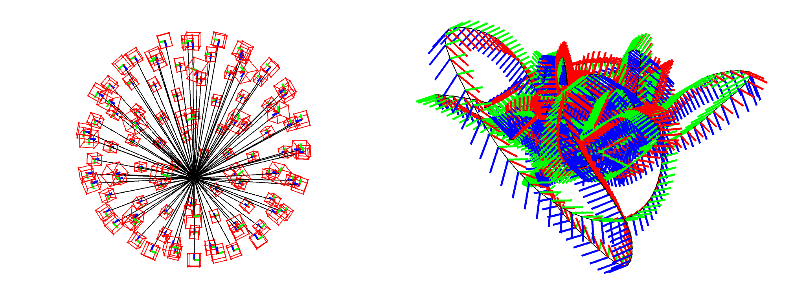
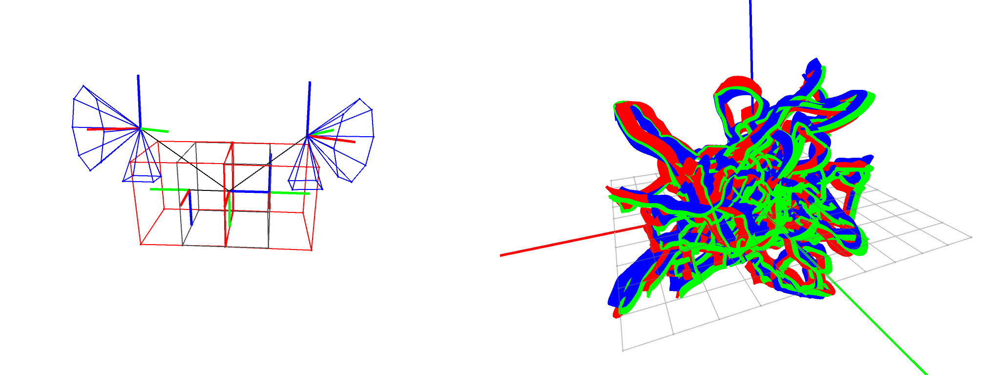
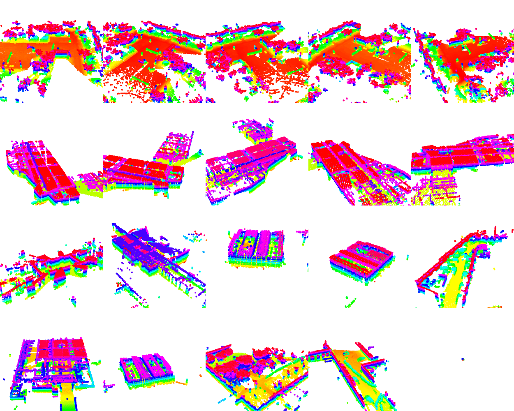
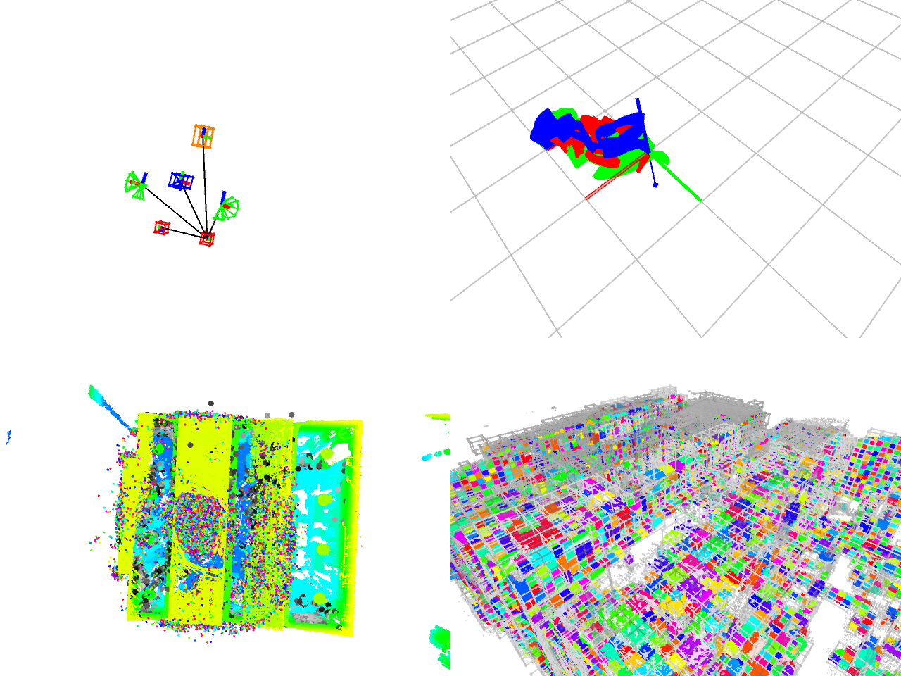
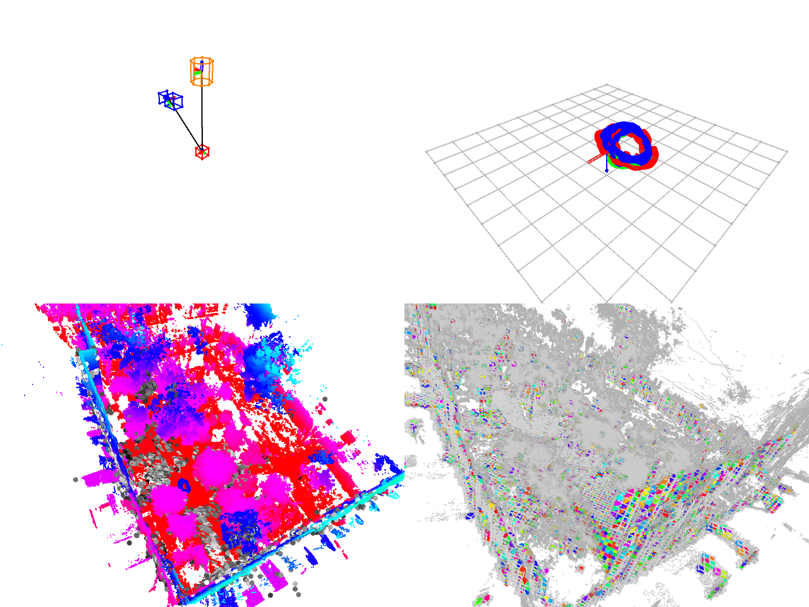
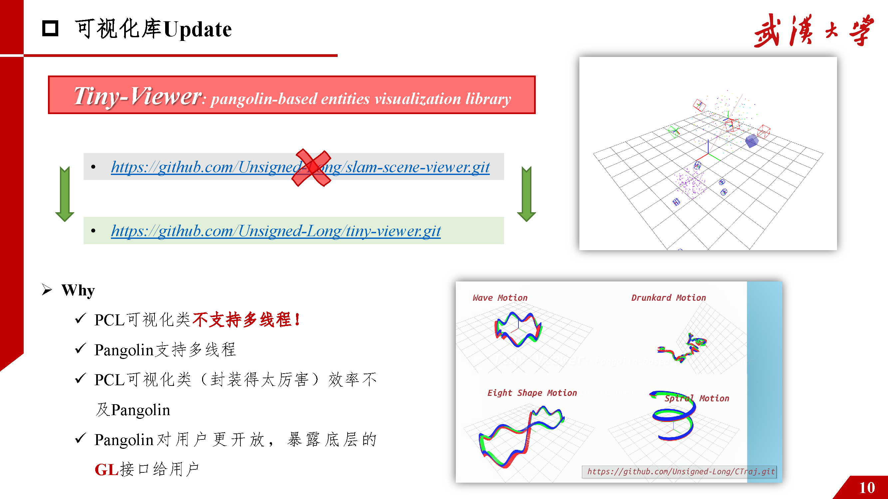
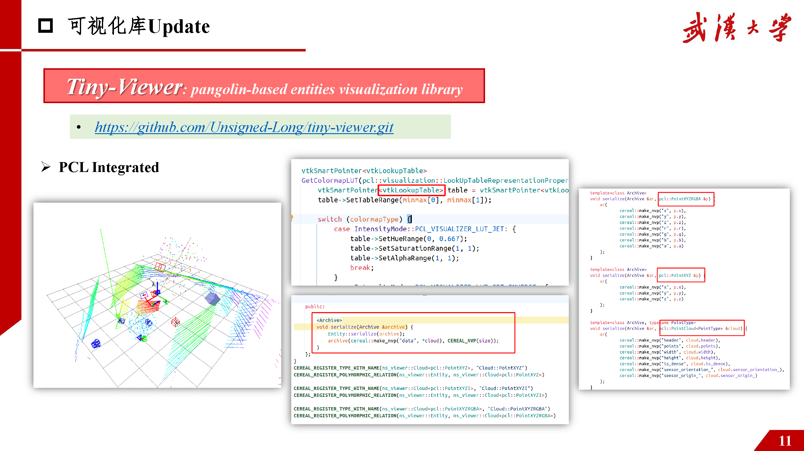
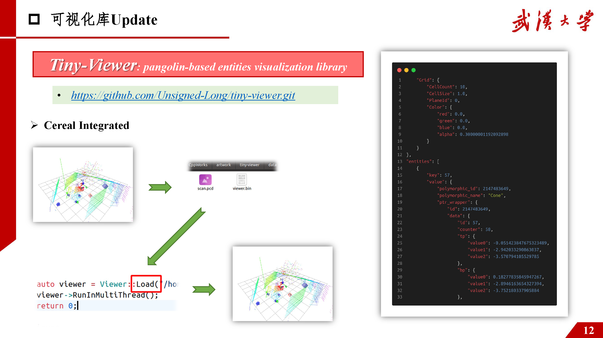
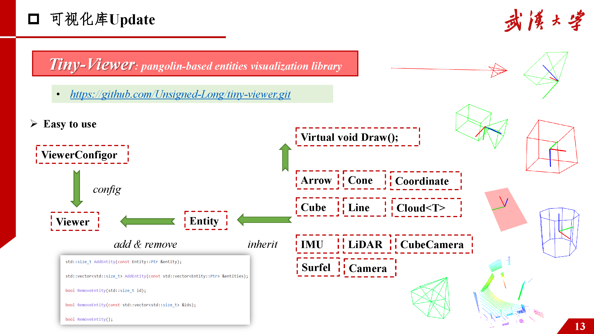

# Tiny-Viewer

## 1. Overview

Try to draw sample but beautiful entities & objects in the pangolin-based scene viewer!

## 2. Examples

  

           
        
      
            
                  
                  
  

## 3. Why

